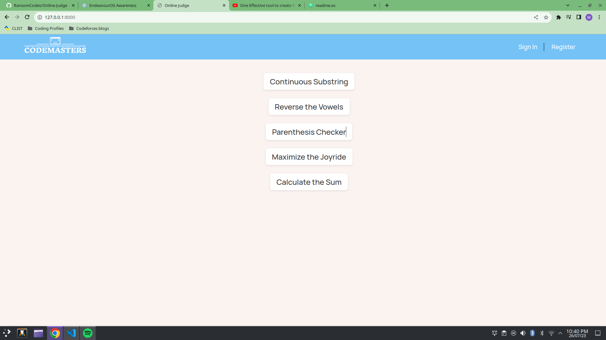
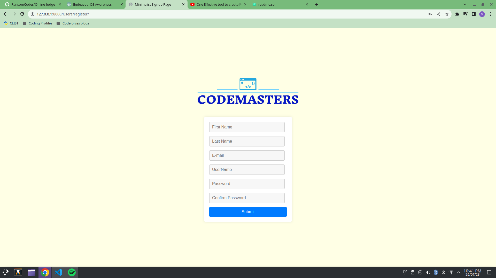
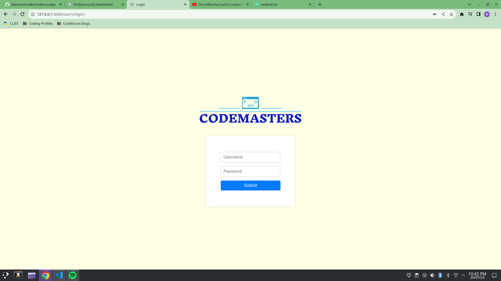
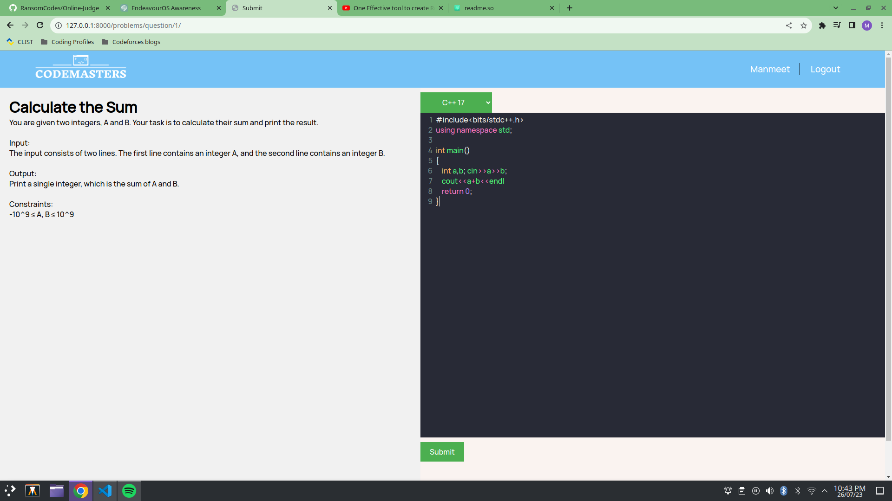
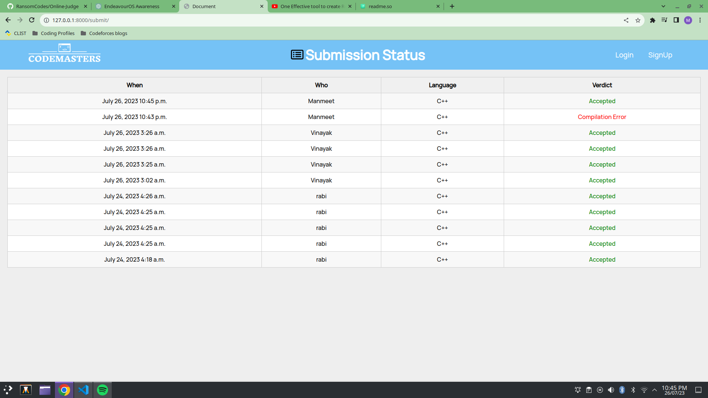

# Online Judge Project

Codemasters is a cutting-edge platform where programmers can put their problem-solving skills to the test by solving a variety of programming challenges listed on the page. Upon submitting their code, the system rigorously examines it against a specific set of test cases to determine if the user's logic is accurate. The platform utilizes a robust tech stack, combining the power of Django and PostgreSQL. The choice of PostgreSQL was deliberate, as it efficiently handles the structured format of data received from users.

The website boasts robust login authentication and authorization mechanisms, ensuring a secure and personalized user experience. To enhance the coding experience, we've integrated the CodeMirror text area, offering users a smooth and efficient code-writing environment.

Codemasters currently supports two different types of programming languages - C++ and Python, giving users the flexibility to code in their preferred language. The code is executed using Python's subprocess module, which compiles the code within a predefined time limit. This approach helps us avoid any timeout errors where the code keeps executing infinitely.

The verdict page showcases essential details, such as the submission's date, time, username, problem ID, and the outcome of the submission's evaluation. Additionally, users can review previous submissions made by all participants, fostering a sense of healthy competition and continuous improvement.

## Table of Contents

- Features
- Tech Stack
- Screenshots

## Features

1. User Registration: New users can sign up for an account by providing their details.

2. User Login: Existing users can log in to access the website's functionalities.

3. Home (Problems Page): Displays a list of programming problems. The name of each problem is displayed.

4. Submission: Users can submit their code for a specific problem in Python or C++. Submissions are stored in the database along with the verdict.

5. Verdict: After submission, users can view the verdict, which includes previous submissions, their results, and the most recent submission at the top.

6. Code Editor: Code submissions are made using a code editor (CodeMirror) that provides syntax highlighting and a user-friendly interface.

## Tech Stack

- Django
- HTML
- CSS
- JavaScript
- PostgreSQL (Database)

## Screenshots

